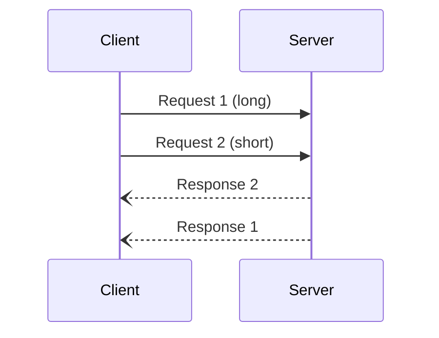

# JSON-RPC SSH Demo

Demonstrates a JSON-RPC 2.0 server over SSH using a self-contained naive JSON
parser (no external dependencies beyond C++17 standard library).



## Deploy & Build

Upload the example to z/OS and build with `make`:

```bash
npx tsx examples/deploy.ts <ssh-profile> <deploy-dir> jsonrpc-ssh
```

## Client

```bash
cd examples/jsonrpc-ssh && npm install
npx tsx client.ts <user>@<host> <deploy-dir>/examples/jsonrpc-ssh/server
```
