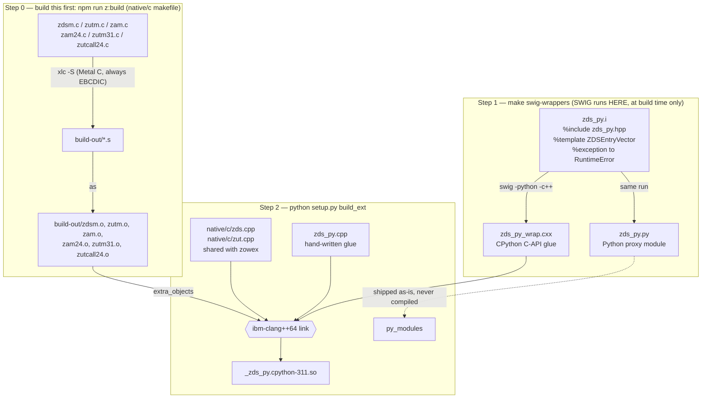
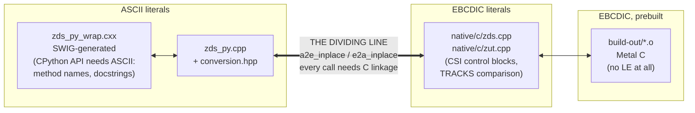
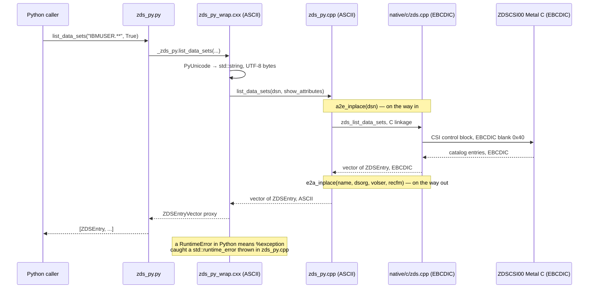
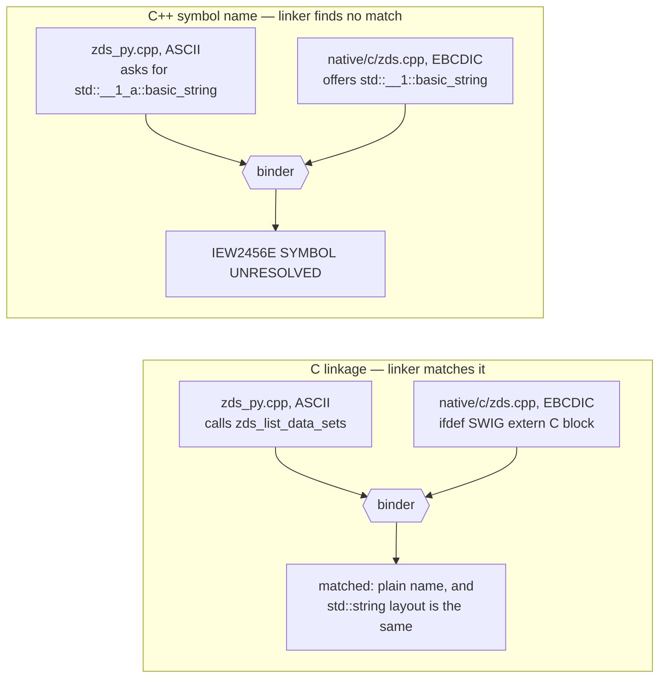

# Zowe Remote SSH Python Bindings Distributions

This directory contains utility scripts to bundle and distribute the Python bindings for the Zowe Remote SSH (ZRS) project on z/OS. 

We provide two distinct packaging scripts, tailored for different deployment needs. Both bundles are completely system agnostic on z/OS and do **NOT** require SWIG to be installed on the target machine.

## Available Functions

The bindings are split across three modules, each generated from the corresponding `*_py.hpp` header. All functions raise a Python exception (`RuntimeError`) on failure instead of returning an error code.

### `zds_py` — Data Sets

| Function | Description |
| --- | --- |
| `create_data_set(dsn: str, attributes: DS_ATTRIBUTES)` | Create a new dataset with the specified attributes. |
| `list_data_sets(dsn: str, show_attributes: bool = False) -> list[ZDSEntry]` | List datasets matching the given pattern. Pass `show_attributes=True` to populate `dsorg`, `volser`, `recfm` and `migrated`. |
| `read_data_set(dsn: str, codepage: str = "") -> str` | Read content from a dataset with optional encoding. |
| `write_data_set(dsn: str, data: str, codepage: str = "", etag: str = "") -> str` | Write data to a dataset with optional encoding and etag validation. |
| `delete_data_set(dsn: str)` | Delete the specified dataset. |
| `create_member(dsn: str)` | Create a new member in a partitioned dataset. |
| `list_members(dsn: str) -> list[ZDSMem]` | List all members in a partitioned dataset. |

**Supporting types:**

- `DS_ATTRIBUTES`: `alcunit`, `blksize`, `dirblk`, `dsorg`, `primary`, `recfm`, `lrecl`, `dataclass`, `unit`, `dsntype`, `mgntclass`, `dsname`, `avgblk`, `secondary`, `size`, `storclass`, `vol`
- `ZDSEntry`: `name`, `dsorg`, `volser`, `recfm`, `migrated` (all but `name` require `show_attributes=True`)
- `ZDSMem`: `name`

### `zjb_py` — Jobs

| Function | Description |
| --- | --- |
| `list_jobs_by_owner(owner_name: str) -> list[ZJob]` | List all jobs owned by the specified user. |
| `list_jobs_by_owner(owner_name: str, prefix: str, status: str) -> list[ZJob]` | List jobs owned by the specified user, filtered by job name prefix and status. |
| `get_job_status(jobid: str) -> ZJob` | Get the current status of a job by job ID. |
| `list_spool_files(jobid: str) -> list[ZJobDD]` | List all spool files (DD statements) for a job. |
| `read_spool_file(jobid: str, key: int) -> str` | Read the content of a specific spool file by job ID and key. |
| `get_job_jcl(jobid: str) -> str` | Retrieve the JCL content for a job. |
| `submit_job(jcl_content: str) -> str` | Submit JCL content and return the assigned job ID. |
| `delete_job(jobid: str) -> bool` | Delete a job from the system and return success status. |

**Supporting types:**

- `ZJob`: `jobname`, `jobid`, `owner`, `status`, `full_status`, `retcode`, `correlator`
- `ZJobDD`: `jobid`, `ddn`, `dsn`, `stepname`, `procstep`, `key`

### `zusf_py` — USS (Unix System Services)

| Function | Description |
| --- | --- |
| `create_uss_file(file: str, mode: str)` | Create a new USS file with the specified permissions. |
| `create_uss_dir(file: str, mode: str)` | Create a new USS directory with the specified permissions. |
| `list_uss_dir(path: str, options: ListOptions = ListOptions(False, False)) -> str` | List contents of a USS directory. |
| `move_uss_file_or_dir(source: str, destination: str)` | Move a USS file or directory. |
| `read_uss_file(file: str, codepage: str = "") -> str` | Read content from a USS file with optional encoding. |
| `read_uss_file_streamed(file: str, pipe: str, codepage: str = "", content_len: size_t* = None)` | Read USS file content to a pipe in streaming mode. |
| `write_uss_file(file: str, data: str, codepage: str = "", etag: str = "") -> str` | Write data to a USS file with optional encoding and etag validation. |
| `write_uss_file_streamed(file: str, pipe: str, codepage: str = "", etag: str = "", content_len: size_t* = None) -> str` | Write data from a pipe to a USS file in streaming mode. |
| `chmod_uss_item(file: str, mode: str, recursive: bool = False)` | Change permissions of a USS file or directory. |
| `delete_uss_item(file: str, recursive: bool = False)` | Delete a USS file or directory, with optional recursion. |
| `chown_uss_item(file: str, owner: str, recursive: bool = False)` | Change ownership of a USS file or directory. |
| `chtag_uss_item(file: str, tag: str, recursive: bool = False)` | Change the file tag of a USS file or directory. |

**Supporting types:**

- `ListOptions(all_files: bool = False, long_format: bool = False, max_depth: int = 1)`

## Architecture

Each module is a CPython extension. Building one runs SWIG plus two different IBM compilers, and the
finished extension has to hand strings back and forth between code that stores text as ASCII and code
that stores it as EBCDIC. This section shows where that dividing line sits, because putting it in the
wrong place corrupts your data instead of breaking the build.

### The build pipeline

`npm run z:python:build` runs `make` in this directory, and its default target is
`all: swig-extenders build`. Build the native code first with `npm run z:build` — the Metal C object
files come from the `native/c` makefile, not from this one.



**SWIG only ever runs on the build machine.** It reads the `.i` files and writes two things:
`*_py_wrap.cxx`, which gets compiled into the `.so`, and `*_py.py`, which ships exactly as generated —
that second file is the module you `import`. That is why neither distribution below needs SWIG on the
target machine. The source bundle ships the generated `.cxx` and only has to recompile it, and the
precompiled bundle ships the finished `.so` next to the `*_py.py`.

### Where the ASCII/EBCDIC line falls

The `-fzos-le-char-mode` flag tells `ibm-clang++64` which encoding to store string literals in. Left
alone the compiler picks EBCDIC, but Python's own build flags (from `sysconfig`) add
`-fzos-le-char-mode=ascii`, so every file compiled through `setup.py` gets ASCII instead. The flag
applies to one source file at a time, which lets `setup.py` choose per file:



| box | where its encoding comes from |
| --- | --- |
| ASCII literals | Python's `sysconfig` build flags: `-fzos-le-char-mode=ascii` |
| EBCDIC literals | added back by `BuildExtMixedCharMode` in `setup.py`: `-fzos-le-char-mode=ebcdic` |
| EBCDIC, prebuilt | `xlc` Metal C — always EBCDIC, no flag involved |

The files under `native/c` have to stay EBCDIC. They build control blocks a byte at a time and count on
their literals already being EBCDIC: the CSI filter key in `zds_list_data_sets`, for instance, is padded
with `' '` and that blank has to be `0x40`. They also call Metal C routines, which run with no Language
Environment and know nothing about ASCII. Compiling these files as ASCII still builds cleanly — it just
quietly changes what every literal means.

### A call crossing the line



### Why calls across the line need `extern "C"`

IBM's libc++ gives each encoding mode its own namespace name, so an ASCII `std::string` and an EBCDIC
`std::string` end up with different symbol names in the object files. As far as the linker is concerned
they are two unrelated types. So anything the bindings call has to be declared inside an
`#ifdef SWIG extern "C"` block in the shared header — `native/c/zds.hpp`, `native/c/zjb.hpp` and
`native/c/zusf.hpp` each have one. Miss a declaration and the bind step fails with `IEW2456E`:



Only the name differs; the two `std::string` types have identical memory layout. So once the linker can
find the symbol, passing a `std::string` or a `std::vector` across the line is safe. C linkage does come
with two limits:

- **It cannot handle overloads,** since every C name has to be unique. `zjb_list_by_owner` has three
  overloads, so only the owner/prefix/status one is declared for SWIG; the two convenience forms sit
  behind `#ifndef SWIG`.
- **It cannot return a C++ type.** `zusf_format_file_entry` returns a `std::string`, so it has to stay
  outside the block.

### Which strings get converted

The rule is simple: **convert the text yourself only if the shared layer will not.** The two columns
below differ because the shared layers disagree about who converts file content.

| what crosses | `zds_py` / `zjb_py` | `zusf_py` |
| --- | --- | --- |
| DSN / path / jobid / owner / prefix / tag | `a2e` | `a2e` |
| codepage name, etag going in | `a2e` | `a2e` |
| etag coming back | `e2a` | `e2a` |
| `diag.e_msg`, listing text, `ZJob` / `ZDSEntry` fields | `e2a` | `e2a` |
| file or data set **content** | `a2e` / `e2a` | none |

`zusf` converts content in both directions on its own: it checks the requested codepage and the file
tag together, so leaving the content untouched is what makes it round-trip whether the file is tagged or
not. Data sets have no tag, so `zds` converts only when you pass an explicit codepage — which leaves the
binding to convert the content itself.

> **Known limitation:** because of that split, passing an explicit codepage to `read_data_set` or
> `write_data_set` (anything other than `""` or `"binary"`) converts the content twice and hands back an
> empty string. Etags have a matching gap: they are converted on the way out but not on the way in, so
> an etag you pass back in will never match. Stick to the default codepage until both are fixed.

## Distribution Types

### 1. Precompiled Binary Distribution (`zbind_bin_dist.tar.gz`)
*Designed for end-users who just want to use the Python bindings immediately without compiling anything.*

- **Compiled on:** The build mainframe (e.g. `lpar.1`).
- **Dependencies needed on target:** Only Python (e.g. Python 3.11, 3.12, etc.). **No compiler, SWIG, C++ sources, or headers are required.**
- **How to Build:**
  ```bash
  python package_precompiled.py
  ```
  This creates `zbind_bin_dist.tar.gz` containing precompiled shared libraries (`_*.so`), wrapper modules (`*.py`), and package metadata.

- **How to Extract & Use on Target Machine (e.g. `lpar.2`):**
  1. Transfer `zbind_bin_dist.tar.gz` to the target machine (binary mode).
  2. Unpack the tarball safely (disabling C-runtime autoconversion):
     ```bash
     chtag -b zbind_bin_dist.tar.gz
     python3 -c "import gzip; f_in = gzip.open('zbind_bin_dist.tar.gz', 'rb'); f_out = open('zbind_bin_dist.tar', 'wb'); f_out.writelines(f_in); f_in.close(); f_out.close()"
     chtag -b zbind_bin_dist.tar
     tar -xf zbind_bin_dist.tar && rm zbind_bin_dist.tar
     ```
  3. Untag the files inside the extracted folder:
     ```bash
     chtag -r zbind_bin_dist/*
     ```
  4. Import instantly in your scripts using `sys.path`:
     ```python
     import sys
     sys.path.insert(0, "/path/to/zbind_bin_dist")
     
     from zusf_py import list_uss_dir
     print(list_uss_dir("/tmp"))
     ```

### 2. Self-Contained Source Distribution (`zbind_src_dist.tar.gz`)
*Designed for environments where you need to build and install the bindings locally from source (e.g. target machines with different or multiple Python versions), but without SWIG.*

- **Dependencies needed on target:** Python and `ibm-clang`. **SWIG is NOT required.**
- **How to Build:**
  ```bash
  python package_zbind.py
  ```
  This creates `zbind_src_dist.tar.gz` containing all required C++ sources, headers, precompiled Metal C object files, and a flat-layout optimized `setup.py`.

- **How to Extract & Install on Target Machine:**
  1. Transfer `zbind_src_dist.tar.gz` to the target machine (binary mode).
  2. Unpack the tarball safely:
     ```bash
     chtag -b zbind_src_dist.tar.gz
     python3 -c "import gzip; f_in = gzip.open('zbind_src_dist.tar.gz', 'rb'); f_out = open('zbind_src_dist.tar', 'wb'); f_out.writelines(f_in); f_in.close(); f_out.close()"
     chtag -b zbind_src_dist.tar
     tar -xf zbind_src_dist.tar && rm zbind_src_dist.tar
     ```
  3. Untag the C++ files inside the extracted directory so that autoconversion works:
     ```bash
     cd zbind_src_dist
     chtag -r *.cpp *.hpp *.h *.cxx chdsect/*.h
     ```
  4. Build and install inside your target Python environment:
     ```bash
     export CC=ibm-clang64
     export CXX=ibm-clang++64
     
     # Option A: Build in-place
     python setup.py build_ext --inplace
     
     # Option B: Install via pip
     pip install .
     ```
